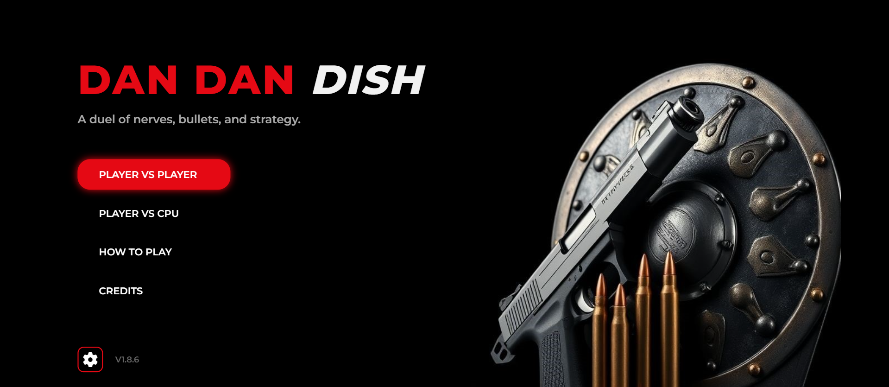

  

  <a href="https://sailok25.github.io/dan_dan_dish/" 
     style="background-color:#4CAF50;color:white;padding:12px 24px;text-align:center;text-decoration:none;display:inline-block;border-radius:8px;font-size:18px;">
    ¡Juega ahora!
  </a>

# DanDanDish 🎮

**DanDanDish** es un juego estilo *“piedra, papel o tijera”*, pero con temática de combate.  
Los jugadores deben decidir entre **recargar**, **disparar** o **protegerse**, administrando sus balas y anticipando las acciones del oponente.

## 📌 Contenido
- [Cómo jugar](#-cómo-jugar)
- [Reglas del juego](#-reglas-del-juego)
- [Tecnologías](#-tecnologías-utilizadas)
- [Screenshots](#-screenshots)

## 🕹️ Cómo jugar
1. Ambos jugadores empiezan con **0 balas**.  
2. En cada turno, un jugador elige una acción:
   - **Recargar** → obtener una bala.  
   - **Disparar** → solo si tienes balas.  
   - **Escudo** → protegerte de un posible disparo.  
3. El juego compara ambas elecciones y aplica las reglas.  
4. Gana quien elimine al otro primero.
> 🎯 **Objetivo:** Ganar la partida sobreviviendo en cada ronda con estrategia y suerte.

## ⚖️ Reglas del juego

| Jugador | Oponente | Resultado |
|----------|-----------|-----------|
| Recargar | Disparar | Muere el jugador |
| Disparar | Recargar | Gana el jugador |
| Disparar | Disparar | Ambos mueren (empate) |
| Escudo | Disparar | Bloquea el disparo; oponente pierde 1 bala |
| Disparar | Escudo | Bloqueo del oponente; jugador pierde 1 bala |
| Recargar | Recargar | Ambos recargan |
| Escudo | Escudo | No pasa nada |

## 💻 Tecnologías utilizadas
- **HTML5** — estructura y contenido  
- **CSS3** — estilos visuales  
- **JavaScript** — lógica del juego  
- **Node.js + Socket.IO** — modo multijugador online
  

## 📸 Screenshots

  
  <!-- 
   -->

